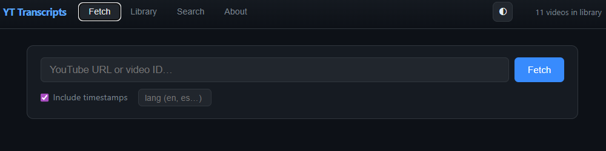

# yt-dock



A self-hosted YouTube transcript library that runs as a single Docker container.
No API keys. No cloud. Your data lives in a file on your machine. After embedding, the build runs at single digit millisecond latency on CPU and less than 400mb of RAM.

-blue)


## Contents

- [Why I Built This](#why-i-built-this)
- [What's Interesting About It](#whats-interesting-about-it)
- [Features](#features)
- [Stack](#stack)
- [Quick Start](#quick-start)
- [API Reference](#api-reference)
- [Data Persistence](#data-persistence)
- [LLM / MCP Usage](#llm--mcp-usage)
- [Project Structure](#project-structure)
- [Important: Legal & Ethical Notice](#important-legal--ethical-notice)
- [License](#license)

---

## Why I Built This

When working on projects with LLMs, I found myself wanting to reference OSS details and ideas from videos I had watched.  Even in normal converations, it isn't easy to have an LLM "know" what was in a video. I also wanted to search across things I'd watched — not just re-read one
transcript, but ask questions like *"which video talked about mixture-of-experts?"* or
*"find everything where someone mentioned fine-tuning vs RAG."*

Every tool I found either required an API key, stored data in the cloud, or was a
multi-service deployment. I wanted something local, persistent, and searchable — that I
could point an LLM at over a simple REST API.

---

## What's Interesting About It

### DuckDB as a vector database

Most people reach for Postgres + pgvector, Chroma, or Qdrant for semantic search.
This uses DuckDB's built-in `array_cosine_similarity` function — no separate vector DB,
no extra service, no configuration. The embeddings live in the same file as the rest of
your data, and the cosine similarity query is a single SQL line:

```sql
SELECT video_id, title,
       array_cosine_similarity(embedding, ?::FLOAT[384]) AS similarity
FROM transcripts
ORDER BY similarity DESC
LIMIT 10
```

DuckDB is a file. There's no server to start, no port to expose, no daemon to manage.
The entire transcript library — metadata, full text, summaries, and 384-dimensional
embeddings — is `./data/transcripts.db`.

### Streaming progress via SSE

When you fetch a video in the UI, the server streams each pipeline step back in real time
using Server-Sent Events. The client opens an `EventSource` connection and receives
step completions as they happen: metadata → transcript → summary → embedding → saved.

No polling. No fake progress bars. The UI reflects exactly what the server is doing.

### Embedding model baked into the image

The `all-MiniLM-L6-v2` sentence embedding model is downloaded during `docker build`,
not at runtime. After the first build, container startup is instant — the model is
already in the image layer.

### CPU-only PyTorch saves ~7 GB

The default image uses PyTorch's CPU-only wheel index. This keeps the image around 2 GB
instead of ~9.5 GB. A GPU profile is available for those who want it — see below.

The trick is installing `torch` before `requirements.txt`. When `pip` processes
`sentence-transformers` later, it finds `torch` already satisfied and skips its own
copy. The `--index-url https://download.pytorch.org/whl/cpu` flag does the rest.

---

## Features

- Fetch transcripts by full YouTube URL or bare video ID
- Rich metadata: title, channel, publish date, duration, thumbnail, chapters
- Auto-summarization (LSA extractive) on every fetch
- Semantic / vector search powered by `all-MiniLM-L6-v2` + DuckDB cosine similarity
- Full-text keyword search with snippet extraction
- Hybrid search (Reciprocal Rank Fusion of keyword + semantic) for best general-purpose results
- Organize videos into categories (folders) and filter the library by category
- Export any video to Markdown (summary + chapters + full transcript)
- Automatic deduplication — fetching the same video twice is instant
- `include_timestamps` toggle works on cached entries (re-formats from stored raw data)
- Browser UI with Fetch, Library, and Search tabs; light/dark themes; About tab
- REST API for LLM / MCP integration

---

## Stack

| Layer | Choice | Why |
|---|---|---|
| Server | FastAPI + uvicorn | Async, SSE support, auto docs at `/docs` |
| Storage | DuckDB | File-based, built-in vector similarity |
| Transcripts | youtube-transcript-api | Official caption API, no scraping |
| Metadata | yt-dlp | Title, channel, chapters, thumbnail |
| Embeddings | sentence-transformers `all-MiniLM-L6-v2` | Fast, local, 384-dim |
| Summarization | sumy LSA | Extractive, no LLM required |
| Container | Docker + Compose | One command to run everything |

---

## Quick Start

**Requirements:** Docker Desktop (or Docker Engine + Compose)

```powershell
# Windows
.\scripts\start.ps1
```

```bash
# Linux / macOS
./scripts/start.sh
```

```bash
# Any platform, directly
docker compose up -d
```

First build takes a few minutes — it downloads the embedding model into the image layer.
Every subsequent start is instant.

### Changing the port

The UI/API is published on port **8000** by default. To use a different port,
copy `.env.example` to `.env` and edit `YTDOCK_PORT`:

```bash
cp .env.example .env
# edit .env, set e.g. YTDOCK_PORT=9000
```

The container always listens on `8000` internally; `YTDOCK_PORT` only changes
the port published on your machine.

### Stopping

```powershell
.\scripts\stop.ps1          # Windows
```
```bash
./scripts/stop.sh           # Linux / macOS
docker compose down         # any platform
```

Once running:

| URL | What's there |
|---|---|
| `http://localhost:<port>` | Browser UI |
| `http://localhost:<port>/docs` | Interactive API explorer |
| `http://localhost:<port>/health` | Status + library size |

### GPU mode (optional)

```powershell
docker compose --profile gpu up --build
```

Requires NVIDIA Container Toolkit. Produces a ~9.5 GB image vs ~2 GB for CPU.
Both profiles share the same `./data` volume and port.

GPU mode uses the CUDA-enabled PyTorch wheel, which allows embedding generation to run on compatible NVIDIA GPUs. This can significantly speed up the embedding step for large transcripts, when the video library grows larger, or when multiple embeddings need to be generated simultaneously, but is not required for typical use cases.

---

## API Reference

### `GET /health`

```json
{ "status": "ok", "library_size": 42, "db": "/data/transcripts.db" }
```

---

### `POST /get_transcript`

Fetch or retrieve a transcript. Accepts a URL or bare video ID.

```json
{
  "video_id_or_url": "https://youtu.be/dQw4w9WgXcQ",
  "lang": "en",
  "include_timestamps": true
}
```

`lang` and `include_timestamps` are optional. Response includes `video_id`, `title`,
`channel`, `language`, `transcript`, `summary`, `chapters`, `fetched_at`, `cached`.

---

### `GET /search?q=<term>&limit=20`

Full-text keyword search across all stored transcripts. Returns a snippet around each match.

---

### `GET /semantic_search?q=<phrase>&limit=10`

Vector search using cosine similarity on sentence embeddings. Better than keyword search
for concept-level queries.

```json
{
  "query": "mixture of experts routing",
  "results": [
    { "video_id": "...", "title": "...", "summary": "...", "similarity": 0.8741 }
  ]
}
```

---

### `GET /hybrid_search?q=<term>&limit=10`

Combines keyword and semantic search using Reciprocal Rank Fusion. Results that
rank well in either search rise to the top. Best general-purpose search mode.

```json
{
  "query": "mixture of experts",
  "results": [
    { "video_id": "...", "title": "...", "channel": "...", "summary": "..." }
  ]
}
```

Note: hybrid results do not include a `similarity` field — RRF fuses two rankings,
so a single similarity score is not meaningful.

---

### `PATCH /library/{video_id}`

Set a video's category (folder). Body: `{ "category": "AI" }`. Returns 404 if
the video is not in the library. An empty or whitespace-only category value is
automatically coerced to `"Uncategorized"`.

---

### `GET /library`

List all stored videos, newest first. Accepts an optional `?category=<name>` query
parameter to filter results to a single category. Each video in the response includes
a `category` field.

---

### `DELETE /library/{video_id}`

Remove a video. Returns 404 if not found.

---

### `GET /export/{video_id}`

Returns `{ "markdown": "...", "filename": "..." }` — the full formatted transcript,
summary, and chapter list ready to save as a `.md` file.

---

## Data Persistence

Transcripts are stored in `./data/transcripts.db`. This folder is mounted as a Docker
volume — stopping, removing, or rebuilding the container does **not** delete your data.
To wipe the library, delete `./data/transcripts.db`.

---

## LLM / MCP Usage

Point your local LLM or MCP client at `http://localhost:<port>`.

```
Fetch the transcript for https://youtu.be/abc123 and summarize it.
Search my library for "prompt engineering".
Semantic search for "mixture of experts architecture".
Export the Andrej Karpathy video as markdown.
Show everything in my transcript library.
```

---

## Project Structure

```
yt-dock/
├── app/
│   ├── main.py         # FastAPI server — all endpoints
│   ├── rrf.py          # Reciprocal Rank Fusion helper
│   └── index.html      # Browser UI (single file, no build step)
├── scripts/
│   ├── start.ps1       # Windows start
│   ├── stop.ps1        # Windows stop
│   ├── start.sh        # Linux / macOS start
│   └── stop.sh         # Linux / macOS stop
├── data/               # Persistent volume — your DB lives here
├── docker-compose.yml
├── Dockerfile
├── requirements.txt
└── .env.example         # Port configuration template
```

---

## ⚠️ Important: Legal & Ethical Notice

**This project is for personal, local, and educational use only.**

- YouTube transcripts and video content are the intellectual property of their creators.
  Using this tool does not grant you any rights to that content.
- Be mindful of and respectful toward content creators. Do not use this tool to
  scrape, redistribute, or commercially exploit transcripts or any derived content.
- Comply with YouTube's [Terms of Service](https://www.youtube.com/t/terms) at all times.
- This tool accesses only publicly available caption data through the same mechanism
  used by YouTube's own interface.

**By using this software, you accept full responsibility for how you use it.**
The author is not liable for any misuse, copyright infringement, ToS violations,
or any other consequences arising from your use of this tool.

See [LICENSE](LICENSE) for the full terms.

---

## License

See [LICENSE](LICENSE).
